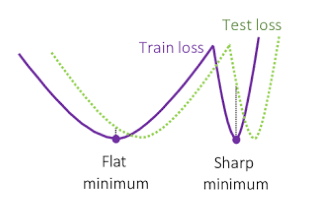
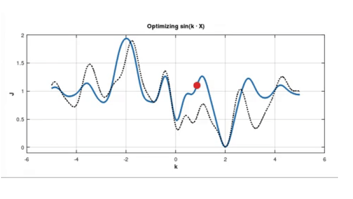

This is the first of a series of posts that collects notes from the course [advaced topics in machine learning]("https://dssc.units.it/advanced-topics-machine-learning"). If you find any mistakes or I've forgotten to cite you feel free to reach out!
## Neural Tangent Kernel
We want to explicit the relationship between kernel methods and neural network:  
Shallow learning (using kernel):
- the feature map $\phi(x)$ is **fixed**
- the model is $f(x) = \langle w , \phi(x) \rangle$

Deep learning (using neural network):
- the feature map is **compositional** $\phi(x)\_{L} = \phi\_{L} \circ \phi\{L-1} \circ ... \circ \phi\_{1}(x)$
and it is **learned**
- the model is $f(x) = \langle w , \phi(x)\_{L} \rangle$

The link between the two models is *Neural Tangent Kernel* (NTK), the mathematical details can be found at [ntk](https://lilianweng.github.io/posts/2022-09-08-ntk/), here we limit to provide the intuition behind it.  
The empirical loss function of a neural network 
$
\mathcal{L}: \mathbb{R}^P \rightarrow \mathbb{R}\_{+}
$ is defined as follow, using a per-sample cost function 

$\ell: \mathbb{R}^{n\_0} \times \mathbb{R}^{n\_L} \rightarrow \mathbb{R}\_{+}$ :
$$
\mathcal{L}(\theta)=\frac{1}{N} \sum\_{i=1}^N \ell\left(f\left(\mathbf{x}^{(i)} ; \theta\right), y^{(i)}\right)
$$,
where $\theta$ is the parameter of the neural network, $f(x; \theta)$ is the output of the neural network, $\ell$ is the loss function, $x\_{i}$ is the input and $y\_{i}$ is the target
using the chain rule the gradient is 
$$
\nabla\_\theta \mathcal{L}(\theta)=\frac{1}{N} \sum\_{i=1}^N \underbrace{\nabla\_\theta f\left(\mathbf{x}^{(i)} ; \theta\right)}\_{\text {size } P \times n\_L} \underbrace{\nabla\_f \ell\left(f, y^{(i)}\right)}\_{\text {size } n\_L \times 1}
$$ 
When we perform a gradient descent update we introduce only a small increment in the weight for an infinitesimal step size for this reason we can approximately interpret the variation of the weights as:
$$
\frac{d \theta}{d t}=-\nabla\_\theta \mathcal{L}(\theta)=-\frac{1}{N} \sum\_{i=1}^N \nabla\_\theta f\left(\mathbf{x}^{(i)} ; \theta\right) \nabla\_f \ell\left(f, y^{(i)}\right)
$$
The solution of the ODE in the above expression is known as [\*gradient flow\*](https://statmech.stanford.edu/post/gradient\_flows\_01/) 
When can use this result to derive an expression for the evolution of the network output:
$$
\frac{d f(\mathbf{x} ; \theta)}{d t}=\frac{d f(\mathbf{x} ; \theta)}{d \theta} \frac{d \theta}{d t}=-\frac{1}{N} \sum\_{i=1}^N \underbrace{\nabla\_\theta f(\mathbf{x} ; \theta)^{\top} \nabla\_\theta f\left(\mathbf{x}^{(i)} ; \theta\right)}\_{\text {Neural tangent kernel }} \nabla\_f \ell\left(f, y^{(i)}\right)
$$ <
Here we find the **Neural Tangent Kernel** which is defined as 
$$
K\left(\mathbf{x}, \mathbf{x}^{\prime} ; \theta\right)=\nabla\_\theta f(\mathbf{x} ; \theta)^{\top} \nabla\_\theta f\left(\mathbf{x}^{\prime} ; \theta\right)
$$
and the associated feature map is $\phi(x) = \nabla\_{\theta} f(x; \theta)$  
The key point is the network is approaching infinite width, the NTK converges to be:

1. deterministic at initialization, meaning that the kernel is irrelevant to the initialization values and only determined by the model architecture;
2. Stay constant during training.

With this setup, we  express the evolution of the network output as:

In order to track the evolution of $\theta$ time we can simplify our model by linearizing it:
$$
f(\theta(t)) \approx f^{\operatorname{lin}}(\theta(t))=f(\theta(0))+\underbrace{\nabla\_\theta f(\theta(0))}\_{\text {formally }\left.\nabla\_\theta f(\mathbf{x} ; \theta)\right|\_{\theta=\theta(0)}}(\theta(t)-\theta(0))
$$
and then we can perform the following analysis:
$$
\begin{aligned}
\theta(t)-\theta(0) & =-\eta \nabla\_\theta \mathcal{L}(\theta)=-\eta \nabla\_\theta f(\theta)^{\top} \nabla\_f \mathcal{L} \\\
f^{\operatorname{lin}}(\theta(t))-f(\theta(0)) & =-\eta \nabla\_\theta f(\theta(0))^{\top} \nabla\_\theta f(\mathcal{X} ; \theta(0)) \nabla\_f \mathcal{L} \\\
\frac{d f(\theta(t))}{d t} & =-\eta K(\theta(0)) \nabla\_f \mathcal{L} \\\
\frac{d f(\theta(t))}{d t} & =-\eta K\_{\infty} \nabla\_f \mathcal{L}
\end{aligned}
$$
; for infinite width network
If the empirical loss is defined as $\nabla\_\theta \mathcal{L}(\theta)=f(\mathcal{X} ; \theta)-\mathcal{Y}$ we can solve the differential equation and obtain the following result: 
$$
\begin{aligned}
\frac{d f(\theta)}{d t} & =-\eta K\_{\infty}(f(\theta)-\mathcal{Y}) \\
\frac{d g(\theta)}{d t} & =-\eta K\_{\infty} g(\theta) \quad ; \text { let } g(\theta)=f(\theta)-\mathcal{Y} \\
\int \frac{d g(\theta)}{g(\theta)} & =-\eta \int K\_{\infty} d t \\
g(\theta) & =C e^{-\eta K\_{\infty} t}
\end{aligned}
$$
and then get:
$$
f(\theta)=(f(\theta(0))-\mathcal{Y}) e^{-\eta K\_{\infty} t}+\mathcal{Y}=f(\theta(0)) e^{-K\_{\infty} t}+\left(I-e^{-\eta K\_{\infty} t}\right) \mathcal{Y}
$$

These results hold for infinite network width, because the change in parameters is infinitesimal, and we can employ the linearization of the model.  
In practice we the taylor expansion is accurate in a specific regime called **lazy training** when the net is heavily over-parametrized and we can witness to decent decrease in the loss $\mathcal{L}$ but minimum change in the jacobian of the matrix is very small 

### Universal approximation theorem
Any continuous function defined in a n-dimensional unit hypercube may be approximated by a finite sum of the type:
$\sum\_{j=1}^N v\_j \varphi\left(\vec{\omega}^{(j)} \cdot \vec{x}+b\_j\right)$
wherein $v\_j, b\_j \in \mathbb{R}, \vec{\omega}^{(j)} \in \mathbb{R}^n$ and $\phi$ is continuoi discriminatory function.

## Regularization
A key concept that motivates the usage of regolarization is called: the \*manifold hypothesis\*. Quoting [wikipedia](https://en.wikipedia.org/wiki/Manifold\_hypothesis)
'The \* manifold hypothesis\* posits that many high-dimensional data sets that occur in the real world actually lie along low-dimensional latent manifolds inside that high-dimensional space. As a consequence of the manifold hypothesis, many data sets that appear to initially require many variables to describes, can actually be described by a comparatively small number of variables, likened to the local coordinate system of the underlying manifold. It is suggested that this principle underpins the effectiveness of machine learning algorithms in describing high-dimensional data sets by considering a few common features...
...Within one of these manifolds, it’s always possible to interpolate between two inputs, that is to say, morph one into another via a continuous path along which all points fall on the manifold.
The ability to interpolate between samples is the key to generalization in deep learning.'

The motivation behind regularization is to enhance the ability of the model to generalize even at discount of the training error.  

### L2 regularization
It is also commonly known as **weight decay** or **ridge regression**, it is a very simple regularization technique that penalizes the model for having large weights by adding the regularization term: $\Omega(\boldsymbol{\theta})=\frac{1}{2}\|\boldsymbol{w}\|\_2^2$.   
We want to analyze the effect of the regularization term on the loss function and the optimal solution. To simplify the analysis we assume no bias parameter so we can write the total objective function as:
$$\tilde{J}(\boldsymbol{w} ; \boldsymbol{X}, \boldsymbol{y})=\frac{\alpha}{2} \boldsymbol{w}^{\top} \boldsymbol{w}+J(\boldsymbol{w} ; \boldsymbol{X}, \boldsymbol{y})$$
and the gradient w.r.t parameters:
$$
\nabla\_{\boldsymbol{w}} \tilde{J}(\boldsymbol{w} ; \boldsymbol{X}, \boldsymbol{y})=\alpha \boldsymbol{w}+\nabla\_{\boldsymbol{w}} J(\boldsymbol{w} ; \boldsymbol{X}, \boldsymbol{y})
$$
A single step of gradient descent with learning rate $\epsilon$ is:
$$
\boldsymbol{w} \leftarrow \boldsymbol{w}-\epsilon\left(\alpha \boldsymbol{w}+\nabla\_{\boldsymbol{w}} J(\boldsymbol{w} ; \boldsymbol{X}, \boldsymbol{y})\right) .
$$
which can be rewritten as:
$$
\boldsymbol{w} \leftarrow(1-\epsilon \alpha) \boldsymbol{w}-\epsilon \nabla\_{\boldsymbol{w}} J(\boldsymbol{w} ; \boldsymbol{X}, \boldsymbol{y}) .
$$
Thus we can see that the effect of the regularization term is to rescale the weight vector by a factor of $(1-\epsilon \alpha)$ on every step.  
We want to extend our analysis to the entire course of the training, but first of all, we further simplify the analysis by making a quadratic approximation of the loss function around the optimal unregularized solution $\boldsymbol{w}^\*$: 
$$
\hat{J}(\boldsymbol{\theta})=J\left(\boldsymbol{w}^\*\right)+\frac{1}{2}\left(\boldsymbol{w}-\boldsymbol{w}^\*\right)^{\top} \boldsymbol{H}\left(\boldsymbol{w}-\boldsymbol{w}^\*\right)
$$
where $\boldsymbol{H}$ is the Hessian matrix of $J$. Remark: the first order term is 0 because we are the minimum and for the same reason $\boldsymbol{H}$ is positive semidefinite. The minimum of $\widehat{J}$ occurs when 
$$
\nabla\_{\boldsymbol{w}} \hat{J}(\boldsymbol{w})=\boldsymbol{H}\left(\boldsymbol{w}-\boldsymbol{w}^\*\right)
$$
Now want to perform spectral analysis of the minimum $\boldsymbol{w}^\*$ to explicit the effect of the regularization:

$$
\begin{array}{r}
\alpha \tilde{\boldsymbol{w}}+\boldsymbol{H}\left(\tilde{\boldsymbol{w}}-\boldsymbol{w}^\*\right)=0 \\
(\boldsymbol{H}+\alpha \boldsymbol{I}) \tilde{\boldsymbol{w}}=\boldsymbol{H} \boldsymbol{w}^\* \\
\tilde{\boldsymbol{w}}=(\boldsymbol{H}+\alpha \boldsymbol{I})^{-1} \boldsymbol{H} \boldsymbol{w}^\* .
\end{array}
$$
Since $\boldsymbol{H}$ is real and symmetric we can decompose into a diagonal matrix $\boldsymbol{\Lambda}$
and orthonormal basis of eigenvector $\boldsymbol{\Lambda}$ thus we obtain: 
$$
\begin{aligned}
\tilde{\boldsymbol{w}} & =\left(\boldsymbol{Q} \boldsymbol{\Lambda} \boldsymbol{Q}^{\top}+\alpha \boldsymbol{I}\right)^{-1} \boldsymbol{Q} \boldsymbol{\Lambda} \boldsymbol{Q}^{\top} \boldsymbol{w}^\* \\
& =\left[\boldsymbol{Q}(\boldsymbol{\Lambda}+\alpha \boldsymbol{I}) \boldsymbol{Q}^{\top}\right]^{-1} \boldsymbol{Q} \boldsymbol{\Lambda} \boldsymbol{Q}^{\top} \boldsymbol{w}^\* \\
& =\boldsymbol{Q}(\boldsymbol{\Lambda}+\alpha \boldsymbol{I})^{-1} \boldsymbol{\Lambda} \boldsymbol{Q}^{\top} \boldsymbol{w}^\*
\end{aligned}
$$
The effect of the regularization is to rescale the eigenvector by a factor of $\frac{\lambda}{\lambda+\alpha}$, thus the regularization has the effect of reducing the magnitude of the eigenvector of the Hessian matrix which represents the curvature of the function
(recall that if $v^{\intercal}\boldsymbol{H}v > 0$ the function will have positive curvature, and negative curvature if $v^{\intercal}\boldsymbol{H}v < 0$ ). There are two cases:
- $\lambda\_{i} \gg \alpha$ the regularization has a small effect on the eigenvector
- $\lambda\_{i} \ll \alpha$ the regularization has a large effect on the eigenvector
with $\lambda\_{i}$ the eigenvalue of the Hessian matrix $\boldsymbol{H}$ . 
In other words we are filtering out the directions that doesn't not contribute much to reducing the loss function.  
 
 
 
### Connection with noisy input
Let's suppose to add gaussian noise to the inputs of a MLP model in such a that the variance of the noise is amplified by the square weight before going to the next layer 
In the simplified setting of a single layer MLP with a single neuron and without adding non-linearity we have:
Input: $x\_{i} + \mathcal{N}(0,\sigma^{2})$ --> Output: $y\_{i} + \mathcal{N}(0,\sigma^{2}w\_{i}^{2})$  
In this way we are adding to the loss a term containing the square of the weights  
For the explicit derivation:
$$
\begin{aligned}
y^{\text {noisy }} & =\sum\_i w\_i x\_i+\sum\_i w\_i \varepsilon\_i \text { where } \varepsilon\_i \text { is sampled from } N\left(0, \sigma\_i^2\right) \\
\left[\left(y^{\text {noisy }}-t\right)^2\right] & =  E\left[\left(y+\sum\_i w\_i \varepsilon\_i-t\right)^2\right]=E\left[\left((y-t)+\sum\_i w\_i \varepsilon\_i\right)^2\right] \\
& =(y-t)^2+E\left[2(y-t) \sum\_i w\_i \varepsilon\_i\right]+E\left[\left(\sum\_i w\_i \varepsilon\_i\right)^2\right] \\
& =(y-t)^2+E\left[\sum\_i w\_i^2 \varepsilon\_i^2\right] \quad \text { because } \varepsilon\_i \text { is independent of } \varepsilon\_j \\
& =(y-t)^2+\sum\_i w\_i^2 \sigma\_i^2 \quad \text { So } \sigma\_i^2 \text { is equivalent to an L2 penalty }
\end{aligned}
$$

### Dropout
The regularization technique \*dropout\* consists in \*shutting off\* some nodes (input and hidden layer) in a neural network (as seen in Figure 1). Since most of neural networks consisits in a series of
affine transformations and nonlinearities, we can effectively remove a unit from a network by multiplying its output value by zero., thus creating a new network architecture out of the parent network. The nodes are dropped by a dropout probability of p.

There are two main reasons why dropout works at reducing overfitting:
- It reduces the co-adaptation of the units, since the network can't rely on the presence of a particular unit, it has to learn a more robust representation. 'Dropout thus regularizes each hidden unit to be
not merely a good feature but a feature that is good in many contexts.'
- We can interpret the application of dropout as \*bagging\* with a very  large \*ensemble\* obtained with all the \*sub-network\* obtained by dropping out some units. Nevertheless these two methods are not identical cause the \*sub-network\* are not independent since they share the parameters, and the models are not trained to convergence but instead a tiny fraction of the possible
sub-networks are each trained for a single step, and the parameters sharing causes
the remaining sub-networks to arrive at good settings of the parameters
- As we have seen in the before section regularization can be linked to the injection of noise to hidden units. In practice if a specific hidden unit learns a feature to classify an entity, and then we shut off it, the model will have to make another unit learn the same feature (redundant encoding) or another feature that is relevant to classification task, thus the model will be more robust to the loss of a specific unit.

### Data normalization

## Implicit bias
When implementing a statistical model one has to be careful to leverage the complexity so to avoid underfitting  in which there are too few parameters that can't fit the data and overfitting when the model is too complex and it can't generalize.  
A common heuristic in traditional statistics was that model "too" big doesn't provide good generalizationù generally ANN has huge amount of parameters way bigger than the dimension of the sample, and  we would expect the optimization algorithm to get stuck in a local minima over the training set and not achieving good generalization capabilities. We actually observe the opposite, the network seems to biased to reach only certain sets of functions that perform well on the test set, what is going on?  
It turned out that the question is quite deep and involves revist the way that we categorize neural net.
Part of the following work is inspired from the following [lesson](https://www.youtube.com/watch?v=gh9vrvLx7Mo) by Nathan Srebro. 

There are three cornerstones to assess the quality of a neural network in terms of generalization:
- Capacity: How training examples do we need so that if we can fit this model we can actually generalize well?
We have a good understanding of this and it's linear in the number of parameters: $O(|E|)$ (number of edges i.e. parameters)

- Expressive power: We know that neural network are universal approximators but in the general case the require an arbitrarly large neural network. The real question is what can we approximate using a small network? It can be shown that any function that takes a time $T$ to compute can be approximated by a neural network with ~$O(T)$ parameters.

- Computation: In the general case finding the best parameters to fit a set of data is NP-hard. Even if consider functions that are perfectly representable by a single hidden layer network, with don't add noise and we larger network for the training, still the problem doesn't admit any poly-time algorithm  

We observe a very strange fact (add pic of test error decreasing) at some point the train error is approximately zero and the test error is still decreasing, it means that the model is improving its estimation error even if we are using a model with way more parameters this does not make any sense, it means that we have to give better definition of the complexity of the model ( not just the number of parameters)  
 

### Matrix Completion
We present now a clarifying example for the previous statements.
**Matrix completion** is the task of filling in the missing entries of a partially observed matrix, without any restrictions on the number of degrees of freedom in the completed matrix this problem is underdetermined since the hidden entries could be assigned arbitrary values. Thus we should require some assumption on the matrix to create a well-posed problem, such as assuming it has maximal determinant, is positive definite, or is low-rank. 

We consider the setting in which a neural network has to solve the following task:
$$
\min \_{X \in \mathbb{R}^{n \times n}} \| \text { observed }(X)-y \|\_2^2 
$$
Note that the model is completely **agnostic** to any of the restrictions listed above, thus the problem is nonsensical.  
We then rewrite the problem factoring the matrix $X$ as $X=U V^{T}$:
$$
\min \_{X \in \mathbb{R}^{n \times n}} \| \text { observed }(X)-y \|\_2^2 \equiv \min \_{U, V \in \mathbb{R}^{n \times n}}\| \text { observed }\left(U V^{\top}\right)-y \|\_2^2
$$
If we train our model with this setting and using \*gradient descent\* what we observe is that if we take infinitely small stepsize, and with additional conditions the result to which the algorithm converges is the minimum nuclear norm solution. Besides if the data come from low-rank matrices the model achieves good generalization ability  
There's a conjecture associated to this problem:
> With $U(0) \rightarrow 0$, the flow $\dot{U} = - \nabla \| A(UU^{T}) -y \|^{2}$ converge to the minimum nuclear norm solution:
$$
U(\infty) U(\infty)^{\top} \rightarrow \min \_{W \geqslant 0}\|W\|\_\* \text { s.t. }\left\langle A\_i, W\right\rangle=y\_i
$$
[paper](https://papers.nips.cc/paper\_files/paper/2017/hash/58191d2a914c6dae66371c9dcdc91b41-Abstract.html)

### Minimum norm solution in least-square problem
In a simplified setting as the least-square problems we can see more clearly the implicit regularization imposed by the gradient descent  .
The following analysis is taken from [Implicit Regularization in Matrix Factorization](https://arxiv.org/abs/1705.09280) and the [thread](https://math.stackexchange.com/questions/3451272/does-gradient-descent-converge-to-a-minimum-norm-solution-in-least-squares-probl) on stackexchange.  
We want to show that choosing gradient descent as the optimization algorithm in an unregularized, underdetermined least squares problem will converge to the minimum Euclidean norm solution.  
Given a **fat** matrix $\mathrm{A} \in \mathbb{R}^{m \times n}(m<n)$ and vector $\mathrm{b} \in \mathbb{R}^m$, consider the following linear system $\mathrm{x} \in \mathbb{R}^n$:
$$ 
Ax = b
$$
where $A$ has full row rank. Let the singular value decomposition ( SVD) of $A$ be as follows: 
$$
A=U \Sigma V^{\top}=U\left[\begin{array}{ll}\
\Sigma\_1 & O
\end{array}\right]\left[\begin{array}{c}
V\_1^{\top} \\\
V\_2^{\top}
\end{array}\right]=U \Sigma\_1 ~V\_1^{\top}
$$
The **least-norm** solution of $Ax = b$ is given by:
$$
\mathrm{x}\_{\mathrm{LN}}:=\mathrm{A}^{\top}\left(\mathrm{AA}^{\top}\right)^{-1} \mathrm{~b}=\cdots=\mathrm{V}\_1 \Sigma\_1^{-1} \mathrm{U}^{\top} \mathrm{b}
$$
where the inverse of $\mathbf{A A}^{\top}$ exists because of $A$ has full row rank.  

Let the cost function $f: \mathbb{R}^n \rightarrow \mathbb{R}$ be defined by:
$$
f(\mathrm{x}):=\frac{1}{2}\|\mathrm{Ax}-\mathrm{b}\|\_2^2
$$
whose gradient is 
$$
\nabla f(\mathrm{x})=\mathrm{A}^{\top}(\mathrm{Ax}-\mathrm{b})
$$
Using gradient descent with steps $\mu > 0$,
$$
\begin{aligned}
\mathrm{x}\_{k+1} & =\mathrm{x}\_k-\mu \nabla f\left(\mathrm{x}\_k\right) \\\
& =\left(\mathrm{I}-\mu \mathrm{A}^{\top} \mathrm{A}\right) \mathrm{x\}\_k+\mu \mathrm{A}^{\top} \mathrm{b}
\end{aligned}
$$
Hence,
$$
\mathrm{x}\_k=\left(\mathrm{I}-\mu \mathrm{A}^{\top} \mathrm{A}\right)^k \mathrm{x}\_0+\mu \sum\_{\ell=0}^{k-1}\left(\mathrm{I}-\mu \mathrm{A}^{\top} \mathrm{A}\right)^{\ell} \mathrm{A}^{\top} \mathrm{b}
$$
Letting 
$$
\mathrm{y}:=\mathrm{V}^{\top} \mathrm{x}
$$, (so rewriting everything with $A = U\Sigma$),  we get
$$
\begin{aligned}
& \mathrm{y}\_k=\left(\mathrm{I}-\mu \Sigma^{\top} \Sigma\right)^k \mathrm{y}\_0+\mu \sum\_{\ell=0}^{k-1}\left(\mathrm{I}-\mu \Sigma^{\top} \Sigma\right)^{\ell} \Sigma^{\top} \mathrm{U}^{\top} \mathrm{b} \\
&=\left[\begin{array}{cc}
\left(\mathrm{I}-\mu \Sigma\_1^2\right)^k & \mathrm{O} \\
\mathrm{O} & \mathrm{I}
\end{array}\right] \mathrm{y}\_0+\mu \\
& \sum\_{\ell=0}^{k-1}\left[\begin{array}{cc}
\left(\mathrm{I}-\mu \Sigma\_1^2\right)^{\ell} & \mathrm{O} \\
\mathrm{O} & \mathrm{I}
\end{array}\right]\left[\begin{array}{c}
\Sigma\_1 \\
\mathrm{O}
\end{array}\right] \mathrm{U}^{\top} \mathrm{b} \\
&= {\left[\begin{array}{cc}
\left(\mathrm{I}-\mu \Sigma\_1^2\right)^k & \mathrm{O} \\
\mathrm{O} & \mathrm{I}
\end{array}\right] \mathrm{y}\_0+\mu \sum\_{\ell=0}^{k-1}\left[\begin{array}{c}
\left(\mathrm{I}-\mu \Sigma\_1^2\right)^{\ell} \Sigma\_1 \\
\mathrm{O}
\end{array}\right] \mathrm{U}^{\top} \mathrm{b} }
\end{aligned}
$$
Choosing $\mu > 0$ such that all eigenvalues of $\mathrm{I}-\mu \Sigma\_1^2$ are strictly inside the unit circle, then $\mathrm{y}\_k \rightarrow \mathrm{y}\_{\infty}$, where:
$$
\mathrm{y}\_{\infty}=\left[\begin{array}{ll}
\mathrm{O} & \mathrm{O} \\
\mathrm{O} & \mathrm{I}
\end{array}\right] \mathrm{y}\_0+\mu \sum\_{\ell=0}^{\infty}\left[\begin{array}{c}
\left(\mathrm{I}-\mu \Sigma\_1^2\right)^{\ell} \Sigma\_1 \\
\mathrm{O}
\end{array}\right] \mathrm{U}^{\top} \mathrm{b}
$$
where, 
$$
\mu \sum\_{\ell=0}^{\infty}\left(\mathrm{I}-\mu \Sigma\_1^2\right)^{\ell} \Sigma\_1=\mu\left(\mathrm{I}-\mathrm{I}+\mu \Sigma\_1^2\right)^{-1} \Sigma\_1=\Sigma\_1^{-1}
$$
and thus,
$$
\mathrm{y}\_{\infty}=\left[\begin{array}{cc}
\mathrm{O} & \mathrm{O} \\
\mathrm{O} & \mathrm{I}
\end{array}\right] \mathrm{y}\_0+\left[\begin{array}{c}
\Sigma\_1^{-1} \\
\mathrm{O}
\end{array}\right] \mathrm{U}^{\top} \mathrm{b}
$$
Since $x := Vy$
$$
\mathrm{x}\_{\infty}=\mathrm{V}\_2 \mathrm{~V}\_2^{\top} \mathrm{x}\_0+\underbrace{\mathrm{V}\_1 \Sigma\_1^{-1} \mathrm{U}^{\top} \mathrm{b}}\_{=\mathrm{x}\_{\mathrm{LN}}}
$$
Therefore, we conclude that if $x\_{0}$ is orthogonal to the null space of A ( $V^{2}$ belongs to that null space)
, then gradient descent will converge to the least-norm solution.

### Early stopping
The following calculation comes from Ian Goodfellow's book [Deep Learning](https://www.deeplearningbook.org/contents/regularization.html)  

*Early stopping* is a very popular regularization technique that consists in storing the parameter setting reached by the optimization algorithm that realizes the lowest validation set error.   The number of steps hyperparameter has U-shaped validation performance curve, thus the algorithm will be at the beginning of the rise. 
We can see then that *early stopping* can be interpreted as an hyperparameters selection algorithm that prevent overfitting controlling the capacity of the model through the number of steps.  

It has been shown that *early stopping* restricts the optimization procedure to a relatively smaller volume of parameters in the space of the initial parameter value, this is indeed the **regularization effect** of this strategy.  
We can actually push our analysis further and show that in the simple setting of quadratic approximation of the loss this technique is equivalent to L2 regularization.  
Let's start by approximating the cost function $J$ in the neighborhood of the optimal solution $w^\*$ as we did in \*weight decay\*:
$$
\hat{J}(\boldsymbol{\theta})=J\left(\boldsymbol{w}^\*\right)+{ }\_2^1\left(\boldsymbol{w}-\boldsymbol{w}^\*\right)^{\top} \boldsymbol{H}\left(\boldsymbol{w}-\boldsymbol{w}^\*\right)
$$
where $\boldsymbol{H}$ is the Hessian matrix of $J$. For the same reasons stated in L2 section $\boldsymbol{H}$ is positive and semidefinite 
With this approximation, we can rewrite the gradient descent update rule as:
$$
\nabla\_{\boldsymbol{w}} \hat{J}(\boldsymbol{w})=\boldsymbol{H}\left(\boldsymbol{w}-\boldsymbol{w}^\*\right)
$$
Now we will write the update rule, for simplicity we set the initial parameter vector to the origin $w\_{0} = 0$ and then perform spectral decomposition of the Hessian matrix $\boldsymbol{H} = \boldsymbol{Q} \Lambda \boldsymbol{Q}^{\top}$:
$$
\begin{aligned}
\boldsymbol{w}^{(\tau)} & =\boldsymbol{w}^{(\tau-1)}-\epsilon \nabla\_{\boldsymbol{w}} \hat{J}\left(\boldsymbol{w}^{(\tau-1)}\right) \\
& =\boldsymbol{w}^{(\tau-1)}-\epsilon \boldsymbol{H}\left(\boldsymbol{w}^{(\tau-1)}-\boldsymbol{w}^\*\right) \\
\boldsymbol{w}^{(\tau)}-\boldsymbol{w}^\* & =(\boldsymbol{I}-\epsilon \boldsymbol{H})\left(\boldsymbol{w}^{(\tau-1)}-\boldsymbol{w}^\*\right) .
\end{aligned}
$$
and then:
$$
\begin{aligned}
\boldsymbol{w}^{(\tau)}-\boldsymbol{w}^\* & =\left(\boldsymbol{I}-\epsilon \boldsymbol{Q} \boldsymbol{\Lambda} \boldsymbol{Q}^{\top}\right)\left(\boldsymbol{w}^{(\tau-1)}-\boldsymbol{w}^\*\right) \\
\boldsymbol{Q}^{\top}\left(\boldsymbol{w}^{(\tau)}-\boldsymbol{w}^\*\right) & =(\boldsymbol{I}-\epsilon \boldsymbol{\Lambda}) \boldsymbol{Q}^{\top}\left(\boldsymbol{w}^{(\tau-1)}-\boldsymbol{w}^\*\right)
\end{aligned}
$$
In order to guarantee convergence (?) we set $\epsilon$ such that 
$\left|1-\epsilon \lambda\_i\right|<1$ and the update at a time $\tau$ is:
$$
\boldsymbol{Q}^{\top} \boldsymbol{w}^{(\tau)}=\left[\boldsymbol{I}-(\boldsymbol{I}-\epsilon \boldsymbol{\Lambda})^\tau\right] \boldsymbol{Q}^{\top} \boldsymbol{w}^\*
$$
We rewrite $Q^{\top} \tilde{\boldsymbol{w}}$ from !add ref! as:
$$
\begin{aligned}
& \boldsymbol{Q}^{\top} \tilde{\boldsymbol{w}}=(\boldsymbol{\Lambda}+\alpha \boldsymbol{I})^{-1} \boldsymbol{\Lambda} \boldsymbol{Q}^{\top} \boldsymbol{w}^\* \\
& \boldsymbol{Q}^{\top} \tilde{\boldsymbol{w}}=\left[\boldsymbol{I}-(\boldsymbol{\Lambda}+\alpha \boldsymbol{I})^{-1} \alpha\right] \boldsymbol{Q}^{\top} \boldsymbol{w}^\*
\end{aligned}
$$
Now if we compare this update rule of weight decay to the one of a training halted at a time $\tau$ we can see that they are equivalent if we set::
$$
(\boldsymbol{I}-\epsilon \boldsymbol{\Lambda})^\tau=(\boldsymbol{\Lambda}+\alpha \boldsymbol{I})^{-1} \alpha
$$
If then we take the logarithm on both sides and use the Taylor expansion of $log(1+x)$ in the case in which $\epsilon \lambda\_{i} \ll 1$ and $\frac{\lambda\_{i}}{\alpha} \ll 1 $ we get:
$$
\begin{aligned}
& \tau \approx \frac{1}{\epsilon \alpha} \\
& \alpha \approx \begin{array}{c}
1 \\
\tau \epsilon
\end{array}
\end{aligned}
$$
In all the examples of regularization seen so far we have shown that parameter values corresponding to directions of significant curvature (of the
objective function) are affected less than directions of less curvature. In the case of weight decay we have modified the update rule so that we actively rescale $w^{\*}$ along the axis of the eigenvectors while in the case of early stopping the parameters that correspond
to directions of significant curvature tend to be learned early relative to parameters
corresponding to directions of less curvature.   

### Stochastic Gradient Descent
The following are the notes from the [lecture](https://www.youtube.com/watch?v=pZnZSxOttN0) by Sam Smith and the [article](https://www.inference.vc/notes-on-the-origin-of-implicit-regularization-in-stochastic-gradient-descent/)
We start with a motivating example (add first graph in the video):
The following performance comes from a 10-1 Wide-ResNet trained on CIFAR-10 with a constant learning rate. As we can see as the learning rate increases the train accuracy decreases but the test accuracy actually increase. Why is this happening?
**Key Claim**: The SGD is  minimizing a modified loss in which there's a regularization term that is proportional to the learning rate. 
The first step now is to explicit the relationship between optimization and Numerical Integration. It's well known that gradient descent in the limit of infinitesimal step size is equivalent to a gradient flow problem:
$$
\begin{gathered}
\omega\_{i+1}=\omega\_i-\epsilon \nabla C\left(\omega\_i\right) \\
\downarrow{\varepsilon \rightarrow 0} \\
\dot{\omega}=-\nabla C(\omega)
\end{gathered}
$$
But following this interpretation we can see that the gradient descent is actually a numerical integration scheme (*Euler Method*) for a first order ODE. 
$$
\begin{gathered}
\omega(t+\epsilon) \approx \omega(t)+\epsilon f(\omega(t)) \\
\uparrow{\varepsilon \rightarrow 0} \\
\dot{\omega}=f(\omega)
\end{gathered}
$$
  
 
If we follow the steps of Euler update we can see that this approximation scheme introduces a bias at each step and soon the trajectory of the discrete updates will step off from the actual solution.
  
We introduce now an ancillary **modified flow**

$$
\tilde{f}(\omega)=f(\omega)+\epsilon f\_1(\omega)+\epsilon^2 f\_2(\omega)+\ldots
$$

so that the discrete updates on the original flow stay close to the continuous solution to the modified flow for small finite $\epsilon$. In loose term we want to find what flow the scheme is actually interpolating, this ancillary flow is constructed adding to the original flow a series of "correction terms" that should account for the bias introduced by the Euler method  
We proceed by deriving the first term of the modified flow:
1. First we apply n Euler updates  on the modified flow and Taylor expands the result:
$$
\begin{aligned}
\omega\_{t+n} & =\omega\_t+\alpha \tilde{f}\left(\omega\_t\right)+\alpha \tilde{f}\left(\omega\_{t+1}\right)+\alpha \tilde{f}\left(\omega\_{t+2}\right)+\ldots \\
& =\omega\_t+\alpha \tilde{f}\left(\omega\_t\right)+\alpha \tilde{f}\left(\omega\_t+\alpha \tilde{f}\left(\omega\_t\right)\right)+\alpha \tilde{f}\left(\omega\_t+\alpha \tilde{f}\left(\omega\_t\right)+\alpha \tilde{f}\left(\omega\_t+\alpha \tilde{f}\left(\omega\_t\right)\right)\right)+\ldots \\
& =\omega\_t+n \alpha \tilde{f}\left(\omega\_t\right)+(n / 2)(n-1) \alpha^2 \nabla \tilde{f}\left(\omega\_t\right) \tilde{f}\left(\omega\_t\right)+O\left(n^3 \alpha^3\right) .
\end{aligned}
$$
2. Then we send $n \rightarrow \infty$ and set $\alpha=\epsilon / n$, to obtain the solution of the continuous flow:
$$
\begin{aligned}
\omega(t+\epsilon) & =\omega(t)+\epsilon \tilde{f}(\omega(t))+\left(\epsilon^2 / 2 \right) \nabla \tilde{f}(\omega(t)) \tilde{f}(\omega(t))+O(\epsilon^3) \\\
\& =\underbrace{\omega(t)+\epsilon f(\omega(t))}\_{\text {Euler step }}+\epsilon^2(\underbrace{.f\_1(\omega(t))+(1 / 2) \nabla f(\omega(t)) f(\omega(t))})\_{\begin{array}{c}
\text { Set higher order } \\\
\text { terms to zero }
\end{array}}+O(\epsilon^3) 
\end{aligned} 
$$
We want the expression of $\omega(t+\epsilon)$ equal to the expression of the Euler step (the purpose of this ancillary flow is to stay close to the solution obtained with the Euler updates) and thus we have to set higher order terms to 0. Thus we can now come up with an expression of the first correction term
$$
f\_{1}(\omega(t)) = - \frac{1}{2} \nabla f(\omega(t)) f(\omega(t))
$$
 
We have constructed the modified flow in such a way that SGD solve the following problem:

$$
\begin{gathered}
\dot{\omega}=\tilde{f}(\omega) \\
\tilde{f}(\omega)=f(\omega)+\epsilon f\_1(\omega)+\epsilon^2 f\_2(\omega)+\ldots
\end{gathered}
$$

Where $f(\omega) = \nabla C(\omega)$ and 

$$
\begin{aligned}
f\_1(\omega(t)) & =-(1 / 2) \nabla \nabla C(\omega) \nabla C(\omega) \\
& =-(1 / 4) \nabla\left(\|\nabla C(\omega)\|^2\right)
\end{aligned}
$$

Putting everything together we have that for a finite small learning rate:

$$
\begin{aligned}
& \dot{\omega}=-\nabla \widetilde{C}\_{G D}(\omega)+O\left(\epsilon^2\right) \\\
& \widetilde{C}\_{G D}(\omega)=\underbrace{C(\omega)}\_{\text{Original Loss}}+\underbrace{(\epsilon / 4)\|\nabla C(\omega)\|^2}\_{Regularization}
\end{aligned}
$$
We provide an informal intution on why this is happening:
If we consider the segment between two point $\omega\_{t}$, $\omega\_{t+1}$ reached by successive iteration of euler method in the above problem we  have that the gradient in $\omega$ is exactly $\nabla C(\omega)$ whilist the gradient in $\omega\_{t+1}-\delta$ with $\delta$ an infintesimum quantiy, the gradient is approximately $\nabla C(\omega +(\frac{\epsilon}{2}\nabla C))$ thus the gradient of the problem that SGD is solving is on average half a step stale and if we taylor expand it we get:
$$
\begin{aligned}
\nabla C(\omega+(\epsilon / 2) \nabla C) & \approx \nabla C+(\epsilon / 2) \nabla \nabla C \nabla C \\
& =\nabla C+(\epsilon / 4) \nabla\left(\|\nabla C\|^2\right)
\end{aligned}
$$
 
**Random Shuffling**
We proceed our backward analysis of SGD by considering the effect of random shuffling on the optimization problem.  
By random shuffling we mean that we start with a certain order of sample in the dataset, we create batches out of it and at the beginning of every epoch we choose a random permutation of these batches with witch we perform barched gradient descent.  

We now want to rewrite the SGD update rule taking into account random shuffling so we introduce some notation:
$N$ is the number of samples, $B$ size of the batch, $m = \frac{N}{B}$
is the number of updates per epoch, we define the loss over a mini-batch:
$$
\hat{C}\_i=(1 / B) \sum\_{j=i B+1}^{(i+1) B} C\_j(\omega)
$$
and get the following update rule:
$$
\omega\_{i+1}=\omega\_i-\epsilon \nabla \hat{C}\_{i \mbox{mod} m}(\omega)
$$
(with a shuffle every $\mathrm{m}$ updates)  
The module operation at the index is just to enforce that every example appears exactly once per epoch (no overlap between batches).
So we get:
$$
\begin{aligned}
C(\omega) & =(1 / N) \sum\_{i=1}^N C\_i(\omega) \\
& =(1 / m) \sum\_{i=0}^{m-1} \hat{C}\_i(\omega)
\end{aligned}
$$
We now have all the instruments to state the main claim of this lesson:
Let $\omega\_{m}$ the value obtained after the m-th iterate of Random Shuffling SGD, then:
$$
\begin{aligned}
\mathbb{E}\left(\omega\_m\right) & =\omega(m \epsilon)+O\left(m^3 \epsilon^3\right) \\
\dot{\omega} & =-\nabla \widetilde{C}\_{S G D}(\omega)
\end{aligned}
$$
Thus the mean iterate lies in the solution of what is still a gradient flow problem, and the expression of the modified loss is:
$$
\widetilde{C}\_{S G D}(\omega)=C(\omega)+\frac{\epsilon}{4 m} \sum\_{k=0}^{m-1}\left\|\nabla \hat{C}\_k(\omega)\right\|^2
$$
We remark the expectation is over the order of the mini-batches and not on their composition
Proof:
We start with the Taylor expansion of the updates over:
$$
\begin{aligned}
\omega\_m & =\omega\_0-\epsilon \nabla \hat{C}\_0\left(\omega\_0\right)-\epsilon \nabla \hat{C}\_1\left(\omega\_1\right)-\epsilon \nabla \hat{C}\_2\left(\omega\_2\right)-\ldots \\
& =\omega\_0-\epsilon \nabla \hat{C}\_0\left(\omega\_0\right)-\epsilon \nabla \hat{C}\_1\left(\omega\_0-\epsilon \nabla \hat{C}\_0\left(\omega\_0\right)\right)-\ldots \\
& =\omega\_0-\epsilon \sum\_{j=0}^{m-1} \nabla \hat{C}\_j\left(\omega\_0\right)+\epsilon^2 \sum\_{j=0}^{m-1} \sum\_{k<j} \nabla \nabla \hat{C}\_j\left(\omega\_0\right) \nabla \hat{C}\_k\left(\omega\_0\right)+O\left(m^3 \epsilon^3\right) \\
& =\omega\_0-m \epsilon \nabla C\left(\omega\_0\right)+\epsilon^2 \xi\left(\omega\_0\right)+\dot{O}\left(m^3 \epsilon^3\right)
\end{aligned}
$$
where $\xi(\omega)=\sum\_{j=0}^{m-1} \sum\_{k<j} \nabla \nabla \hat{C}\_j(\omega) \nabla \hat{C}\_k(\omega)$
we remark that at $O(\epsilon)$ there's no variance cause is the full gradient, thus in the limit of vanishing learning rate Random Shuffling follows the same path of SGD. The third term instead at $O(\epsilon^2)$ cares about the order of the minibatches thus is random variable with non-null mean and variance 
If we average over all possible minibatch orders we get:
$$
\begin{aligned}
\mathbb{E}(\xi(\omega)) & =\frac{1}{2}\left(\sum\_{j=0}^{m-1} \sum\_{k \neq j} \nabla \nabla \hat{C}\_j(\omega) \nabla \hat{C}\_k(\omega)\right) \\
& =\frac{m^2}{2} \nabla \nabla C(\omega) \nabla C(\omega)-\frac{1}{2} \sum\_{j=0}^{m-1} \nabla \nabla \hat{C}\_j \nabla \hat{C}\_j \\
& =\frac{m^2}{4} \nabla\left(\|\nabla C(\omega)\|^2-\frac{1}{m^2} \sum\_{j=0}^{m-1}\left\|\nabla \hat{C}\_j(\omega)\right\|^2\right)
\end{aligned}
$$
We have now an expression for the mean iterate:
$$
\begin{aligned}
\mathbb{E}\left(\omega\_m\right) & =\omega\_0-m \epsilon \nabla C\left(\omega\_0\right) \\
& +\frac{m^2 \epsilon^2}{4} \nabla\left(\left\|\nabla C\left(\omega\_0\right)\right\|^2-\left(1 / m^2\right) \sum\_{j=0}^{m-1}\left\|\nabla \hat{C}\_j\left(\omega\_0\right)\right\|^2\right)+O\left(m^3 \epsilon^3\right)
\end{aligned}
$$
We recall now the solution of the modified flow derived earlier where the correction term $f\_{1}$ appears:
$$
\begin{gathered}
\tilde{f}(\omega)=-\nabla C(\omega)+\epsilon f\_1(\omega)+O\left(\epsilon^2\right) \\
\omega(m \epsilon)=\omega\_0-m \epsilon \nabla C\left(\omega\_0\right)+m^2 \epsilon^2\left(f\_1\left(\omega\_0\right)+(1 / 4) \nabla\left\|\nabla C\left(\omega\_0\right)\right\|^2\right)+O\left(m^3 \epsilon^3\right)
\end{gathered}
$$
We now set the two expressions equal (the one derived earlier and the mean iterate) and solve for $f\_{1}(\omega\_{0})$, we skip the rather lengthy calculation and QED:
$$
\begin{gathered}
\mathbb{E}\left(\omega\_m\right)=\omega(m \epsilon)+O\left(m^3 \epsilon^3\right) \\
\dot{\omega}=-\nabla \widetilde{C}\_{S G D}(\omega) \\
\widetilde{C}\_{S G D}(\omega)=C(\omega)+\frac{\epsilon}{4 m} \sum\_{k=0}^{m-1}\left\|\nabla \hat{C}\_k(\omega)\right\|^2
\end{gathered}
$$
 
It's important to stress the fact that we're making the rather extreme assumption that $O(m^3\epsilon^3)$ is negligible, this is quite limiting in real applications but it's still a better estimation than the one we get from the previous gradient flow in which we assume negligible the quadratic term. 
Another interesting remark is that most of the analysis on SGD focuses on the variance whilist this revolves around the bias
 
We can push our analysis further and explicit the dependence of the modified loss on the batch size. If we take the expectation of the modified loss over the mini batches we get:

$$
\begin{aligned}
\mathbb{E}\left(\tilde{C}\_{S G D}(\omega)\right) & =C(\omega)+(\epsilon / 4) \mathbb{E}\left(\|\nabla \hat{C}(\omega)\|^2\right) \\
& =C(\omega)+(\epsilon / 4)\|\nabla C(\omega)\|^2+\frac{(N-B)}{(N-1)}(\epsilon / 4 B) \Gamma(\omega)
\end{aligned}
$$

where 

$$
\Gamma(\omega)=(1 / N) \sum\_{i=1}^N\left\|\nabla C\_i(\omega)-\nabla C(\omega)\right\|^2
$$

Let's dissect the above expression:
- The first term is the original loss
- The second term is the regularization term that we have already seen in the previous analysis
- The third term is proportional to the trace of the per example covariance matrix which encodes a preference for the region of parameter spaces in which the gradient of different examples agree. Besides is proportional to $\frac{\epsilon}{4B} which surprisingly motivates the experimental evidence that when you double the batch size the optimal learning rate also doubles   
The lesson now continues with experimental evidence of the above analysis, I omit this section and adress to linked video for all the details.
 

**Discretization Error and Stochasticity**
Does the benefit of SGD require finite learning rate?
In order to answer the question we disentangle the effect of the discretization error and the stochasticity of the mini-batches.
The strategy is:
1. Perform n Euler updates on the same minibatch with bare learning rate $\alpha$
2. Draw a new minibatch and repeat step 1

In this setting the actual learning rate is 
$$
\epsilon = \alpha n
$$
and set the stochasticity,  $\alpha$ set the discretization error cause it encodes the step size of the Euler method. As $n \rightarrow \infty$ $\alpha \rightarrow 0$ thus the discretization error  vanish  
<!---
ADD PLOT
--->what we see now is that Lare bare learning rates \alpha are actually beneficial for the optimization procedure, implying that **discretization error** is beneficial, whilist smaller value of n achieves higher accuracy implying that **stochasticity is detrimental**
<!---
(not very clear!! revise)
--->
  
 
 

**Closing Remarks on gradient descent**
  
 
The goal of an optimization algorithm is to converge to \*good\* minima that behaves well in terms of:
- robustness
- generalization

Both the train-set and test-set are sampled from the same distribution, and for this reason, we expect the train loss function to be very close to the test loss function. What we want is to find a shape of the loss that is robust to small perturbations (that comes from training different samples but from the same distribution). There's an ongoing debate regarding the geometry of these shapes, but a generally accepted idea is that a function with a \*flat\* minima can provide robustness and generalization.   
  
 
<!---
(Not sure rewatch march 22 29.45)
--->
An another geometric intuition for SGD is that at each iteration only a subset of the train set is used to fit the loss function, during the optimization procedure the algorithm average over that different fitted functions and this "ensemble" of function get rid of the "sharp" minima leaving only the "flat" ones.  

### Langevin SGD
It didn't talk about this but if I have time I want to add a few remarks about it.  

### Batch normalization
Quoting from Wikipedia:
"Batch normalization (also known as batch norm) is a method used to make training of artificial neural networks faster and more stable through normalization of the layers' inputs by re-centering and re-scaling" 

Batch normalization is a very effective technique to justify its importance we report the following advantages listed in the [article](https://towardsdatascience.com/batch-normalization-8a2e585775c9)
1. Networks train faster — Each training iteration will actually be slower because of the extra calculations during the forward pass and the additional hyperparameters to train during backpropagation. However, it should converge much more quickly, so training should be faster overall.
2. Allows higher learning rates — Gradient descent usually requires small learning rates for the network to converge. And as networks get deeper, their gradients get smaller during backpropagation so they require even more iterations. Using batch normalization allows us to use much higher learning rates, which further increases the speed at which networks train.
3. Makes weights easier to initialize — Weight initialization can be difficult, and it’s even more difficult when creating deeper networks. Batch normalization seems to allow us to be much less careful about choosing our initial starting weights.
4. Makes more activation functions viable — Some activation functions do not work well in some situations. Sigmoids lose their gradient pretty quickly, which means they can’t be used in deep networks. ReLUs often die out during training, where they stop learning completely, so we need to be careful about the range of values fed into them. Because batch normalization regulates the values going into each activation function, non-linearities that don’t seem to work well in deep networks actually become viable again.
5. Simplifies the creation of deeper networks — Because of the first 4 items listed above, it is easier to build and faster to train deeper neural networks when using batch normalization. And it’s been shown that deeper networks generally produce better results, so that’s great.
Provides a bit of regularization — Batch normalization adds a little noise to your network. In some cases, such as in Inception modules, batch normalization has been shown to work as well as dropout. But in general, consider batch normalization as a bit of extra regularization, possibly allowing you to reduce some of the dropout you might add to a network.
7. May give better results overall — Some tests seem to show batch normalization actually improves the training results. However, it’s really an optimization to help train faster, so you shouldn’t think of it as a way to make your network better. But since it lets you train networks faster, that means you can iterate over more designs more quickly. It also lets you build deeper networks, which are usually better. So when you factor in everything, you’re probably going to end up with better results if you build your networks with batch normalization.  

**smoothing of the objective function**:
In the initial paper in which the method is proposed [Batch Normalization: Accelerating Deep Network Training by Reducing Internal Covariate Shift](https://arxiv.org/abs/1502.03167) they account the effectiveness of this technique to the reduction of the so-called \*internal covariance shift\*. In fact, recent works showed that batch normalization does not reduce internal covariate shift, but rather smooths the objective function, which in turn improves the performance  
The argument proposed in [How Does Batch Normalization Help Optimization?](https://arxiv.org/pdf/1805.11604.pdf) is  BatchNorm produces 
the parameter landscape significantly more smooth. It can be shown that the Lipschitzness of the loss function improves as the magnitudes of the gradients get smaller and as a consequence the loss changes at a smaller rate. In addition the quadratic form of the loss Hessian with respect to the activations in the gradient direction is both rescaled by the input variance (inducing resilience to mini-batch variance), and decreased by an additive factor (increasing smoothness). Since this term represents the second order term of the Taylor expansion of the gradient around the current point reducing it results in making the first order term (the gradient) more predictive.  

Quoting from the paper we can see the connection with the last remarks made at the end of the gradient descent section:

"These smoothening effects impact the performance of the training algorithm in a major way. To
understand why, recall that in a vanilla (non-BatchNorm), deep neural network, the loss function
is not only non-convex but also tends to have a large number of “kinks”, flat regions, and sharp
minima. This makes gradient descent–based training algorithms unstable, e.g., due to exploding
or vanishing gradients, and thus highly sensitive to the choice of the learning rate and initialization.
Now, the key implication of BatchNorm’s reparametrization is that it makes the gradients more
reliable and predictive. After all, improved Lipschitzness of the gradients gives us confidence that
when we take a larger step in the direction of a computed gradient, this gradient direction remains a
fairly accurate estimate of the actual gradient direction after taking that step. It thus enables any
(gradient–based) training algorithm to take larger steps without the danger of running into a sudden
change of the loss landscape such as a flat region (corresponding to vanishing gradient) or sharp local
minimum (causing exploding gradients). This, in turn, enables us to use a broader range of (and thus
larger) learning rates and, in general, makes the training significantly
faster and less sensitive to hyperparameter choices."

It's important to remark that the above analysis works in the setup of inserting a single batch norm in a network. Stacking batchnorms results in gradient explosion at initialization time. The optimization landscape is then extremely non-smooth and then the deep batch norm networks are practically untrainable

**Decoupling**
Add something about it

### Convolutional Neural Networks
Another source of implicit bias comes from the architecture of our neural network.  

**Sparsity in the frequency domain**
We start by reporting some key results from the following paper [Implicit Bias of Gradient Descent on Linear Convolutional Networks](https://arxiv.org/abs/1905.10307)  
In this work, the authors focus on the implicit bias of optimizing multi-layer fully connected linear networks, and linear convolutional
networks. If we simplify our problem by excluding non-linear activation functions both of these types of models ultimately implement linear transformations and thus they belong to the class of all linear predictors. Minimizing the training loss on these models is therefore entirely equivalent to minimizing the training loss for linear classification. 
We indicate a linear predictor as $\beta \in \mathbb{R}^{D}$ and define the map $\mathcal{P}: \mathcal{W} \rightarrow \mathbb{R}^D$ which sends a set of weights in the corresponding linear predictor.
In the case of a binary classification task using logistic loss the global minimum of a loss $\mathcal{L}(\dot)$  defined as 
$$
\min\_{\mathbf{w} \in \mathcal{W}} \mathcal{L\}\_{\mathcal{P}}(\mathbf{w}):=\sum^N \ell\left(\left\langle\mathbf{x}\_n, \mathcal{P}(\mathbf{w})\right\rangle, y\_n\right)
$$
can't be achieved for any finite $\beta$. To overcome this problem the loss can be minimized by scaling the norm of any linear predictor that separates the data to infinity, focusing then on the direction $\overline{\boldsymbol{\beta}}^{\infty}=\lim \_{t \rightarrow \infty} \frac{\boldsymbol{\beta}^{(t)}}{\left\|\boldsymbol{\beta}^{(t)}\right\|}$  
Under some assumptions described in the paper, the authors prove that:
For any depth L, almost all linearly separable
datasets $\{ x\_{n}, y\_{n} \}^{N}\_{n=1}$ almost all initializations $w^{(0)}$, , and any bounded sequence of step sizes $\{\eta\_{t}\}\_{t}$, consider the sequence gradient descent iterates $w^{(t)}$  defined as:
$$
\mathbf{w}^{(t+1)}=\mathbf{w}^{(t)}-\eta\_t \nabla\_{\mathbf{w}} \mathcal{L}\_{\mathcal{P}}\left(\mathbf{w}^{(t)}\right)=\mathbf{w}^{(t)}-\eta\_t \nabla\_{\mathbf{w}} \mathcal{P}\left(\mathbf{w}^{(t)}\right) \nabla\_{\boldsymbol{\beta}} \mathcal{L}(\mathcal{P}(\mathbf{w}(t)))
$$
for minimizing $\mathcal{L}\_{\mathcal{P}\_{\text{full}}}(\mathbf{w})$ as described above  with exponential loss $\ell(\widehat{y}, y)=\exp (-\widehat{y} y)$  over L–layer fully connected linear networks.  

If  the iterates $w^{(t)}$ minimize the objective, i.e., $\mathcal{L}\_{\mathcal{P}\_{\text{full}}}(w(t)) \rightarrow 0$,  $w(t)$, and consequently $\beta^{(t)} = \mathcal{P}\_{\text{full}}(w(t))$, converge in direction to yield a separator with positive margin, and  gradients
concerning linear predictors ∇βL(β(t)) converge in direction, and then the limit direction is given by
$$
\overline{\boldsymbol{\beta}}^{\infty}=\lim \_{t \rightarrow \infty} \frac{\mathcal{P}\_{\text {full }}\left(\mathbf{w}^{(t)}\right)}{\left\|\mathcal{P}\_{\text {full }}\left(\mathbf{w}^{(t)}\right)\right\|}=\frac{\boldsymbol{\beta}\_{\ell\_2}^\*}{\left\|\boldsymbol{\beta}\_{\ell\_0}^\*\right\|} \text {, where } \boldsymbol{\beta}\_{\ell\_2}^\*:=\underset{w}{\operatorname{argmin}}\|\boldsymbol{\beta}\|\_2^2 \quad \text { s.t. } \forall n, y\_n\left\langle\mathbf{x}\_n, \boldsymbol{\beta}\right\rangle \geq 1
$$

This theorem that the implicti bias of gradient descent doesn't depend on the depth of the net. Remarkably the asymptotic
classifier is always the hard margin support vector machine classifier, which is also the limit direction
of gradient descent for linear logistic regression with the direct parameterization of $\beta = w$.

We proceed now to show the equivalent of the above theorem for linear convolutional networks.  
A few notes on the notation:
- $\widehat{\boldsymbol{\beta}} \in \mathbb{C}^D$ are the Fourier coefficients of $\beta$ i.e
$$
\widehat{\boldsymbol{\beta}}[d]=\frac{1}{\sqrt{D}} \sum\_{p=0}^{D-1} \boldsymbol{\beta}[p] \exp \left(-\frac{2 \pi \mathrm{i} p d}{D}\right)
$$
- complex number are denoted in polar form: $z=|z| \mathrm{e}^{\mathrm{i} \phi\_z}$ for $\psi\_z \in [0, 2\pi)$
We now claim:  
For almost all linearly separable datasets ${x\_{n}, y\_{n}}^{N}\_{n=1}$, almost all initializations $w(0)$, and any sequence of step sizes $\{ \eta\_{t}\}\_{t}$ with $\eta\_{t}$ smaller than the local Lipschitz at $w(t)$, consider the sequence gradient descent iterates w(t) described before for minimizing 
$\mathcal{L}\_{\mathcal{P}\_\text{conv}}(w)$ in with exponential loss over 2–2-layer linear convolutional networks. If the iterates $w(t)$ minimize the objective, i.e., $\mathcal{L}\_{{P}\text{conv}}(w(t)) \rightarrow 0$, $w(t)$ converge in direction to yield a separator $\overline{\boldsymbol{\beta}}^{\infty}$ with positive margin, the phase of the Fourier coefficients $\widehat{\boldsymbol{\beta}}^{(t)}$ of the linear predictors $\beta(t)$ converge coordinate-wise, i.e., $\forall d$, $\exp^{i\phi}\widehat{\beta^{(t)}}[d] \rightarrow \exp^{i\phi}\overline{\widehat{\beta^{(t)}}}[d]$, and (d) the gradients $\nabla\_{\boldsymbol{\beta}} \mathcal{L}\left(\boldsymbol{\beta}^{(t)}\right)$ converge in direction, then the limit direction $\overline{\boldsymbol{\beta}}^{\infty}$ is given by,
$$
\overline{\boldsymbol{\beta}}^{\infty}=\frac{\boldsymbol{\beta}\_{\mathcal{F}, 1}^\*}{\left\|\boldsymbol{\beta}\_{\mathcal{F}, 1}^\*\right\|}, \text { where } \boldsymbol{\beta}\_{\mathcal{F}, 1}^\*:=\underset{\boldsymbol{\beta}}{\operatorname{argmin}}\|\widehat{\boldsymbol{\beta}}\|\_1 \text { s.t. } \forall n, y\_n\left\langle\boldsymbol{\beta}, \mathbf{x}\_n\right\rangle \geq 1 .
$$

The result above shows if we introduce a convolutional layer, even without explicit regularization, gradient descent is implicitly biased through solutions that are sparse in the frequency domain.  

### Closing remarks
We now conclude our analysis of implicit bias by revising the cornerstones enounced at the beginning of the section:
- Capacity: What's the true complexity measure? We've seen that the number of parameters is usually a poor measure of the capacity of a model because we're not taking into account the implicit regularization added to the loss.
How does the "true" complexity measure control generalization?
- Expressive power: The set of functions that can be represented by a neural network depends in practice on the inductive bias induced by the optimization algorithm and the architecture. 
Does the implicit bias actually match the prior over the distribution that we're trying to infer?
- Computation:  How and where does the optimization bias us? Under what conditions?  

### Double descent
Before diving deep into the topic, there's a phenomenon that is worth mentioning called [**double descent**](https://openai.com/research/deep-double-descent).  
In a series of very popular models like ResNets, ConvNet, and transformers, performance first improves, then gets worse, and then we reach an \*interpolation threshold\* at which the model is barely enough to fit the train set the performance improves again.  
A possible intuition about this phenomenon:
- Case 1: $|\text{dataset}| >> |\text{parameters}|$ There's way more than enough data to pin down the optimal parameters so it generalizes well.
- Case 2: $|\text{dataset}| \approx |\text{parameters}|$ The model is just right to fit the data, it can memorize the data but can't generalize. , there is effectively only one model that fits the train data, and forcing it to fit even slightly noisy or misspecified labels will destroy its global structure. 
- Case 3: $|\text{dataset}| << |\text{parameters}|$ The model can fit the data in many different ways, and regularization bias toward solutions that generalize well.

### Spectral bias
 
 
 
We start our analysis with **Spectral bias** which is the tendency of neural networks to learn functions that are smooth in the frequency domain.  
Is very well known that deep fully-connected networks struggle to accurately approximate high-frequency or multi-scale functions and in the case of *PINN* has been shown that one of the leading reasons is the presence of spectral bias [6](Sifan Wang, Xinling Yu, and Paris Perdikaris. When and why PINNs fail to train: A neural tangent kernel perspective. arXiv preprint arXiv:2007.14527, 2020.). The following analysis is taken from [7](https://www.sciencedirect.com/science/article/pii/S0045782521002759) to which we refer for details.  
We start by proposing the last calculation done in NTK sectio (add a link!) for which we were getting:
$$
f(\mathcal{X},\theta) \approx \left(I-e^{-\eta K\_{\infty} t}\right) \mathcal{Y}
$$
Since K\_{\infty} is a positive definite matrix we can decompose it as $K\_{\infty}=Q \Lambda Q^{T}$ where $\Lambda$ is a diagonal matrix containing the eigenvalues of $K\_{\infty}$ and $Q$ is the matrix of the eigenvectors.  
We can use $e^{-K t}=Q^T e^{-\Lambda t} Q$ and get: 
$$
\boldsymbol{Q}^T\left(f\left(\mathcal{X}, \boldsymbol{\theta}(t)\right)-\mathcal{Y} \right)=-e^{\boldsymbol{\Lambda} t} \boldsymbol{Q}^T \mathcal{Y}
$$

$$
\left[\begin{array}{c}
\boldsymbol{q}\_1^T \\
\boldsymbol{q}\_2^T \\
\vdots \\
\boldsymbol{q}\_N^T
\end{array}\right]\left(f\left(\mathcal{X}, \boldsymbol{\theta}(t)\right)-\mathcal{Y} \right)=\left[\begin{array}{llll}
e^{-\lambda\_1 t} & & & \\
& e^{-\lambda\_2 t} & & \\
& & \ddots & \\
& & & e^{-\lambda\_N t}
\end{array}\right]\left[\begin{array}{c}
\boldsymbol{q}\_1^T \\
\boldsymbol{q}\_2^T \\
\vdots \\
\boldsymbol{q}\_N^T
\end{array}\right] \mathcal{Y}
$$

The above equation shows that the convergence rate of $\boldsymbol{q}\_i^T\left(f\left(\mathcal{X}, \boldsymbol{\theta}(t)\right)-\mathcal{Y} \right)$ is determined by the i-th eigenvalue
$\lambda\_{i}$. Moreover, we can decompose the training error into the eigenspace of the NTK as
$$
\begin{aligned}
f\left(\mathcal{X}, \boldsymbol{\theta}(t)\right)-\mathcal{Y} & =\sum\_{i=1}^N\left(f\left(\mathcal{X}, \boldsymbol{\theta}(t)\right)-\mathcal{Y}, \boldsymbol{q}\_i\right) \boldsymbol{q}\_i \\
& =\sum\_{i=1}^N \boldsymbol{q}\_i^T\left(f\left(\mathcal{X}, \boldsymbol{\theta}(t)\right)-\mathcal{Y}\right) \boldsymbol{q}\_i \\
& =\sum\_{i=1}^N\left(e^{-\lambda\_i t} \boldsymbol{q}\_i^T \mathcal{Y}\right) \boldsymbol{q}\_i .
\end{aligned}
$$
Clearly, the network is biased to first learn the target function along the eigendirections of neural tangent kernel with
larger eigenvalues, and then the remaining components corresponding to smaller eigenvalues. A more detailed analysis
of the convergence rate of different components is illustrated by Cao et al. [32]. For conventional fully-connected
neural networks, the eigenvalues of the NTK shrink monotonically as the frequency of the corresponding eigenfunctions
increases, yielding a significantly lower convergence rate for high-frequency components of the target function [31, 33].
This indeed reveals the so-called “spectral bias” [31] pathology of deep neural networks.
Since the learnability of a target function by a neural network can be characterized by the eigenspace of its neural
tangent kernel, it is very natural to ask: can we engineer the eigenspace of the NTK to accelerate convergence? If this is
possible, can we leverage it to help the network effectively learn different frequencies in the target function? In the
next section, we will answer these questions by re-visitng the recently proposed random Fourier features embedding
proposed by Tancik et al. [41].

## Weight initialization
This is just a reminder to take a look to [weight initialization](https://www.deeplearning.ai/ai-notes/initialization/index.html).
It explains why initializing weights to 0 or just with purely random numbers is a bad choice and how Xavier's initialization allows to have:
- mean of all activations equal to 0
- variance of all activations stays the same across every layer

for a deeper understanding of the math background, we refer to [Understanding the difficulty of training deep feedforward neural networks](https://proceedings.mlr.press/v9/glorot10a/glorot10a.pdf)

## Invariance and Equivariance
In this section, we will introduce two concepts that will be crucial for the following posts of this series of notes: the concept of invariance and equivariance. We will show then their connection with some architectural bias introduced by pooling and convolution  
Given a function $f: A \rightarrow A $ and a group $G$ acting on $A$
we call $f$:
- **invariant**:  if $f(gx)=f(x)$ for all $g \in G$ and $x \in A$
- **equivariant**: if $f(gx)=g f(x)$ for all $g \in G$ and $x \in A$  

### Pooling and Invariance
This stage is usually performed after a convolutional layer and consists in reducing the dimensionality of the input, by substituting a set of values with a summary statistic of the nearby values.  
If we translate the input by a small amount the pooled output stays the same and for this reason, pooling can provide representations that are approximately invariant by small translations.  
In order to show this property we suppose that the pooling is made over the entire picture to simplify the notation and make it more explicit. 
What is the bias imposed using pooling? 
We consider a kernel $K$ and we call $G$ the set of translations that we assume have the structure of a group. We define the i-th element of the output of the convolutional layer with input $x \in \mathbb{R}^N$ as:
$$
\left\langle g\_i K, x\right\rangle=(x \* K)\_i 
$$

We then pool over the entire output:

$$
f(x)=\sum\_i\left\langle g\_i K, x\right\rangle \\
$$

We can see now that:

$$
f(g x)=\sum\_i\left\langle g\_i K, g x\right\rangle=\sum\_i\left\langle g^T g\_i K, x\right\rangle=\sum\_i\left\langle g\_i^{\prime} K, x\right\rangle
$$

with $g^T g\_i=g\_i^{\prime}$. But here we have just reshuffled the elements of this sum thus

$$
f(g x)=f(x) 
$$

### Convolution and Equivariance
We now consider the convolutional layer and we show that it's equivariant to translation.  
We use the same notation as in pooling but here $f(\dot)$ is the first convolutional layer and $\sigma(\dot)$ is the activation function. We have:
$$
f(g x)=\left[\begin{array}{c}
\sigma\left\langle g\_1 w, g x\right\rangle \\
\vdots \\
\sigma\left\langle g\_N w, g x\right\rangle
\end{array}\right]=\left[\begin{array}{c}
\sigma\left\langle w, g\_1^T g x\right\rangle \\
\vdots \\
\sigma\left\langle w, g\_N^T g x\right\rangle
\end{array}\right]=P\_g\left[\begin{array}{c}
\sigma\langle w, g x\rangle \\
\vdots \\
\sigma\langle w, g x\rangle
\end{array}\right]=P\_g f(x)
$$
In other words the translation of the input vector $x$ commutes with the activation function and hence the equivariance:

$$
f(g x)=P\_g f(x)
$$

**Link between equivariance and convolutionality**

We want to analyze now a very important theorem presented by Kondor and Trivedi in this [paper](https://arxiv.org/pdf/1802.03690.pdf)
In this [site](https://dmol.pub/dl/Equivariant.html#groups-on-spaces)
there's a very nice explanation of many concepts of this paper.  
G-Equivariant Convolution Theorem:
A neural network layer (linear map) $\phi$ is G-equivariant if and only if its form is a convolution operator $\*$
$$
\psi(f)=(f \* \omega)(u)=\sum\_{g \in G} f \uparrow^G\left(u g^{-1}\right) \omega \uparrow^G(g)
$$
where  $f: U \rightarrow \mathbb{R}^n$ and $\omega: V \rightarrow \mathbb{R}^n$ are "lifted" functions of the group $U$ and $V$ which are subgroups of $G$ (including possible $G$). On the first layer of a neural network, $f$ is usually defined on the quotient space $U= \frac{G}{H}$. If the group $G$ is locally compact, then the convolution operator is 
$$
\psi(f)=(f \* \omega)(u)=\int\_G f \uparrow^G\left(u g^{-1}\right) \omega \uparrow^G(g) d \mu(g)
$$ 
where $\mu$ is the Haar measure on $G$. 
 
The blog that is linked above explains exhaustively the above theorem, here I just want to point out a few things that were not so intuitive. 
The first confusing thing is the fact that they represent layers in a rather more abstract view, in order to understand it we start by defining the notation: $L\_V(\mathcal{X})$ that denotes the space of function $\{f: \mathcal{X} \rightarrow V\}$.
All the activations in any given layer are collected in a function:
$f^{\ell}: \mathcal{X}\_{\ell} \rightarrow V\_{\ell}$ where $\mathcal{X}\_{\ell}$ is a set indexing the neurons and $\mathcal{V}\_{\ell}$ is a vector space, in the first layer $\mathcal{X}\_{\ell}$ is the set of inputs. In this way we can represent layers as linear maps $\phi^{\ell}: L\_{V\_{\ell}}(\mathcal{X}\_{\ell}) \rightarrow L\_{V\_{\ell+1}}(\mathcal{X}\_{\ell+1})$.  
So in the first layer we are supposing that of each of our samples of the training set comes from a space $\mathcal{X}\_{0}$ and that there's a function $f\_{0}$ that sends this sample to an actual tensor so basically $f\_{0}(x)$ is just one record in the dataset that we fed to the model. 
But in the theorem, $f$ is defined on the quotient space $U= \frac{G}{H}$, so how can we reconcile these two things?  
The fact is that the authors of the papers wanted to work on a much broader generalization of convolution in which the arguments are functions on a compact group $G$.
In this case, the convolution is defined as:
$$
(f \* g)(u)=\int\_G f\left(u v^{-1}\right) g(v) d \mu(v) .
$$
The problem now is to connect the structure of a group $G$ with its homogeneous space $\mathcal{X}$ and we want to provide intuition behind it.  
Since the $\mathcal{X}$ is homogeneous if we fix an $x\_{0}$ , for any $x$ we always have a $g$ s.t $x=g(x\_{0})$. In this way, we can "index" $\mathcal{X}$ through elements of $G$. Now the set of elements of $G$ that sends $x\_{0}$ in itself is a subgroup $H\_{0}$ called the "stabilizer" and all the $g\_{i}$ that sends $x\_{0}$ are coset of this stabilizer we can then chose a coset representative and denote it $\bar{x}$ meaning that it sends $x\_{0}$ to $x$.
We can now make an equivalent $f$ defined now on a group this operation is called "lifting" and we obtain a new function:
$f \uparrow^G(g)$: \frac{G}{H\_{0}} \rightarrow V
defined as:
$$
f \uparrow^G(g)=f\left(g x\_0\right)
$$.
 
As stated in the blog:
"This is a strong theorem. It says there is only one way to achieve equivariance in a neural network. This may seem counter-intuitive since there are many competing approaches to convolutions. These other approaches are actually equivalent to a convolution; just it can be hard to notice."

### Data Augmentation
We have shown that in order to make the neural network learn invariant/ equivariant representations we need to change the architecture to add pooling and convolutional layers. 
There's actually a simpler approach very much used in practice that consists in extending the dataset with some of its samples modified. Generally, it means multiplying the original sample by elements of a group or simply injecting noise in it. 

We want to show now how data augmentation can be used to construct loss an invariant to the action of a group $G$. To make the result more explicit we suppose that the augmented dataset contains the orbits w.r.t the group of each sample.  
Let $G$ be a group acting on the dataset $\mathcal{X}$, $\mathcal{l}(\dot)$ a generic loss, $\sigma(\dot)$ and activation function, $w$ the weight of the model. We suppose that $\forall x \in \mathcal{X}$
then there exist an augmented dataset $\mathcal{X}'$ s.t $g\_{\theta}x \in \mathcal{X}'$ for all $g\_{\theta} \in G$.  
$$
\mathcal{L}(w)=\frac{1}{N} \sum\_{i=1}^N \int \ell\left(\sigma\left\langle w, g\_\theta x\_i\right\rangle ; y\_i\right) d \theta
$$
the loss defined in this way is indeed invariant:
$$
\begin{aligned}
&\begin{aligned}
\mathcal{L}\left(g\_{\bar{\theta}} w\right) & =\frac{1}{N} \sum\_{i=1}^N \int \ell\left(\sigma\left\langle w, g^\* g\_\theta x\_i\right\rangle ; y\_i\right) d \theta \\
& =\sum\_{i=1}^N \int \ell\left(\sigma\left\langle w, g\_\theta x\_i\right\rangle ; y\_i\right) d \theta \\
& =\mathcal{L}(w)
\end{aligned}\\
&g\_\theta g\_{\theta^{\prime}}=g\_{\theta^{\prime \prime}}
\end{aligned}
$$ 

 
It's interesting to review this approach from a more "harmonic" perspective.  
Using the idea above about the loss in general we can construct an invariant function in the following way:
Let $\bar{f}: \mathbb{R} \rightarrow \mathbb{R}$  s.t $\bar{f}(\omega+q)=\bar{f}(\omega) \forall q \in \mathbb{R}$. $\bar{f}$ is constant and  $\widehat{f}(0)$ is the only non zero Fourier transform.

$$
\underline{\mathrm{f}}(w)=\int\_{-\infty}^{\infty} d t f(w-t), \quad f: \mathbb{R} \rightarrow \mathbb{R} .
$$
Let's relax now the invariance property, as it happens in real applications, and settle for approximate invariance, that is, robustness. To do so we limit to integrate over $[-a,a]$ instead of the whole real line.
$$
\underline{\mathbf{f}}(w)=\int\_{-a}^a d t f(w-t)=\int\_{-\infty}^{+\infty} d t \operatorname{Ind}\_{[-a, a]}(t) f(w-t) .
$$
taking the Fourier and usign the property $\widehat{f(\cdot-t)}=e^{i k t} \hat{f}(k)$:
$$
\hat{\mathrm{f}}(k)=\left(\int\_{-\infty}^{\infty} d t e^{i k t} \operatorname{Ind} d\_{[-a, a]}(t)\right) \hat{f}(k)=2 a \operatorname{sinc}(2 k a) \hat{f}(k) .
$$
Switching back to our original problem about the loss the above results show that if I do data augmentation the effect on the loss is to modulate the Fourier transform of some coefficient $2a sin(2ka)$, this is the implicit bias Because is biasing towards low frequencies!
But having a biased loss means having a biased gradient of the loss and thus the updated of weights using gradient descent are biased. 
For instance, if we consider:
$$
\mathcal{L}\left(g\_\theta w ; X, y\right)=\mathcal{L}(w ; X, y), \quad \theta \in R
$$
where $g\_{\theta} \in G$ which under whose action is invariant, then:
$$
\frac{d}{d \alpha} \mathcal{L}\left(U\_\alpha w\right)=0 \rightarrow\left\langle\nabla\_w \mathcal{L}(w), \partial\_\alpha U\_\alpha w\right\rangle=0
$$
Thus some directions in the gradient are not allowed by the invariance of the loss
 

**Learned weights and symmetry**
As we have seen in the previous section data agumentation bias the loss function and consequently the gradient descent and the learned weights. The effect on the last is remarkably evident as we can see in the below picture:

 
 
In figure learned weights for, respectively, translation (a), rotation (b),
scale (c) and horizontal-vertical flip (d) single data symmetry
To explicit the connection between the implicit bias of the loss and the weights we redirect to the following [paper](https://arts.units.it/retrieve/856df9ab-4e98-4bab-b71e-591336d25db0/Data\_Symmetries\_and\_Learning\_in\_Fully\_Connected\_Neural\_Networks.pdf) the provides all the details.
Furthermore, in the paper they analyze how data augmentation affects the loss in the frequency domain. Using the property:
$$
\hat{\mathcal{L}}(g W)(K)=|\operatorname{det} g|^{-1} \hat{\mathcal{L}}\left(\left(g^T\right)^{-1} K\right)
$$
<!---
ASK TO ANSELMI I don't understand it

-->

### Permutation Equivariant layer
in the paper [DeepSets](https://arxiv.org/pdf/1703.06114.pdf) the authors provide some theoretical understanding for designing a permutational equivarian layer. 
Using the definition of equivariance provided before let's define a neural network layer as:
$$
\mathrm{f}\_{\Theta}(\mathbf{x}) \doteq \sigma(\Theta \mathbf{x}) \quad \Theta \in \mathbb{R}^{M \times M}
$$
where $\Theta$ is a weight vector and $\sigma$ is a non-linear activation function. The following lemma presented in the paper suggests a sufficient conditions for permutations-equivariance in this type of functions 
**Lemma 3** The function $\mathbf{f}\_{\Theta}: \mathbb{R}^M \rightarrow \mathbb{R}^M$ as defined above is permutation equivariant if and only if all the off-diagonal elements of $\Theta$ are tied together and all the diagonal elements are equal as well:
That is 
$$
\Theta=\lambda \mathbf{I}+\gamma\left(\mathbf{1 1}^{\boldsymbol{\top}}\right) \quad \lambda, \gamma \in \mathbf{R} \quad \mathbf{1}=[1, \ldots, 1]^{\boldsymbol{\top}} \in \mathbb{R}^M
$$
where $\mathbf{I} \in \mathbb{R}^{M \times M}$ is the identity matrix.  

The key concept behind the proof consists in noting that  
$$
\sigma(\Theta \Pi x) = \Pi \sigma(\Theta x) \\
\sigma(\Theta \Pi x) - \sigma(\Pi \Theta x) = 0
$$
So we are asking $\Theta \Pi = \Pi \Theta $ and then
$$
\Pi^{top} \Theta \Pi = \Theta
$$
thus we're looking for $\Theta$ that is invariant under conjugation  
 

For a more detailed analysis:

- To see why $\Theta=\lambda \mathbf{I}+\gamma\left(\mathbf{1} 1^{\top}\right)$ commutes with any permutation matrix first note that commutativity is linear- that is 
$$
\Theta\_1 \pi=\pi \Theta\_1 \wedge \Theta\_2 \pi=\pi \Theta\_2 \quad \Rightarrow \quad\left(a \Theta\_1+b \Theta\_2\right) \pi=\pi\left(a \Theta\_1+b \Theta\_2\right)
$$
Since both Identity matrix $\boldsymbol{I}$, and constant matrix $\boldsymbol{11}^{\top}$, commute with any permutation
matrix, so does their linear combination $\Theta=\lambda \mathbf{I}+\gamma\left(\mathbf{1} 1^{\top}\right)$.
- We need to show that in a matrix $\Theta$ that commutes with “all” permutation matrices
    - *All diagonal elements are identical*: Let $\pi\_{k,l}$ for $1 \leq k, l \leq M$ $k \neq l$, be a transposition (i.e. a permutation that only swaps two elements).  The inverse permutation matrix of $\pi\_{k,l}$ l is the permutation matrix of $\pi\_{k,l} = \pi\_{k,l}^{\top}$. We see that commutativity of $\Theta$ with the transposition $\pi\_{k,l}$ implies that $\Theta\_{k,k} = \Theta\_{l,l}$:

    $$
    \Theta\_1 \pi=\pi \Theta\_1 \wedge \Theta\_2 \pi=\pi \Theta\_2 \quad \Rightarrow \quad\left(a \Theta\_1+b \Theta\_2\right) \pi=\pi\left(a \Theta\_1+b \Theta\_2\right)
    $$
    Therefore, $\pi$ and $\Theta$ commute for any permutation $\pi$, they also commute for any transposition $\pi\_{k,l}$ and therefore $\Theta\_{i,i} = \lambda \forall i$.
 
    - All off-diagonal elements are identical: We show that since $\Theta$ commutes with any
    product of transpositions, any choice of two off-diagonal elements should be identical.
    Let $(i,j)$ and $(i',j')$ be the index of two off-diagonal elements (i.e $i \neq j$ and $i' \neq j'$). Moreover, for now assume
    $i \neq j$ and $i' \neq j'$. Application of the transposition $\pi\_{i,i'}\Theta$, swaps the rows  $i,i'$ in $\Theta$. Similarly, $\Theta\pi\_{j,j'}$ switches the $j^{th}$ column with $j'^{th}$ column. From commutativity property of $\Theta$ and $\pi \in S\_n$  (the group of symmetry) we have:
    $$
    \begin{aligned}
    & \pi\_{j^{\prime}, j} \pi\_{i, i^{\prime}} \Theta=\Theta \pi\_{j^{\prime}, j} \pi\_{i, i^{\prime}} \Rightarrow \pi\_{j^{\prime}, j} \pi\_{i, i^{\prime}} \Theta\left(\pi\_{j^{\prime}, j} \pi\_{i, i^{\prime}}\right)^{-1}=\Theta \\
    & \pi\_{j^{\prime}, j} \pi\_{i, i^{\prime}} \Theta \pi\_{i^{\prime}, i} \pi\_{j, j^{\prime}}=\Theta \Rightarrow\left(\pi\_{j^{\prime}, j} \pi\_{i, i^{\prime}} \Theta \pi\_{i^{\prime}, i} \pi\_{j, j^{\prime}}\right)\_{i, j}=\Theta\_{i, j} \quad \Rightarrow \Theta\_{i^{\prime}, j^{\prime}}=\Theta\_{i, j}
    \end{aligned} \quad \Rightarrow
    $$
    where in the last step we used our assumptions that $i \neq i^{\prime}, j \neq j^{\prime}, i \neq j$ and $i' \neq j'$. In the cases where either $i=i^{\prime}$ or $j=j^{\prime}$, we can use the above to show that $\Theta\_{i, j}=\Theta\_{i^{\prime \prime}, j^{\prime \prime}}$ and $\Theta\_{i^{\prime}, j^{\prime}}=\Theta\_{i^{\prime \prime}, j^{\prime \prime}}$ for some $i^{\prime \prime} \neq i, i^{\prime}$ and $j^{\prime \prime} \neq j, j^{\prime}$ and conclude $\Theta\_{i,j} = \Theta\_{i',j'}$

### Compositional Prior
missing, probably will add it inside geometric deep learning.
Take a look at this https://en.wikipedia.org/wiki/Capsule\_neural\_network

## Interpretability
As machine learning-based algorithms are increasingly used in real-world applications, the need for understanding their decisions is becoming more and more important. 
Unfortunately, ANNs are still a blackboxs but some strategies has been devised to try to shed light on what's going on underneath.
In this section, we will highlight some concepts and approaches regarding the interpretability of neural networks.  
A very naive approach is to use designed features that are also interpretable, but this is limiting the expressive power of the network. This approach is called \*signal processing\* and was famous a few decades ago.
This shows one of the main problems with current machine learning: it's a **trade-off between performance and interpretability**.  
When the model is agnostic to explicit biases the data "speaks" for themselves but the results are difficult/impossible to interpret.  

**Feature Visualization**
Another way to make ANN more interpretable is to devise a way to visualize the features that the network is learning.  
On the [page](https://distill.pub/2017/feature-visualization/) there's a beatiful introduction to this topic.  
The images below are made creating the input that "excites" the neurons the most per each layer. It's interesting to notice how the pattern to which each layer is more sensible becomes progressively complicated. 

 
During the lessons, we introduced a technique for \*feature visualization\* using **attention map**.  
The idea is that we want to create a map in the Fourier space for the images in order to filter out the frequencies that affect the most the prediciton.
We start by training our net to solve a task, for example, recognizing cats from dogs. 
Then we create a mask that has to be trained to filter the most important frequencies. The training iterate will consist of taking a pic from the dataset, mapping it in the Fourier Space, applying the mask, and feeding this preprocessed image to the initial network.
We then calculate the loss taking into account the error in the prediction and the sparsity of the mask.  
The goal is to have the sparser mask that still allows the network to perform well on the task.   
The result of this procedure can be seen below:

 
As we can see the elements on which the network is focusing are very different from the ones that we would have expected. The majority of the frequencies are killed and only very few are retained, this raises a possible risk of exploitation cause we can fool the network into misclassifying elements by constructing on purpose ambiguous images. 

An interesting pathology presented in this [paper](/https://arxiv.org/abs/1811.12231) shows that CNNs classified on Image-Net seem to be biased towards texture rather than shape. It's interesting to notice that the texture is pattern to which the first layers pay more attention as we can see in the previous pic.  

**Physical Laws**
Up to now, we have seen examples only for images but there's other contexts in which the nature of the problem allows some simplifications in terms of interpretability.  
From a more computer-scientific perspective physical laws can be seen as very efficient algorithms to predict natural phenomena. The key aspects the affect how to compose such rules are:
- select relevant variables
- find the simplest function of the variable that explains the experiments
The last rule is based on the rather romantic idea that the universe is simple and elegant, but as a matter of fact, they reflect just the amount of complexity that our brain can deal with. Another requirement that we need to make sense of physical law is that is to be written in "language" that we can understand, that is through interpretable objects like: 
$$
\partial\_{\mathbf{x}}, \partial\_{\mathbf{t}}, \nabla, \mathbf{P}, \mathbf{V}, \ldots
$$
In the [article](https://www.science.org/doi/10.1126/sciadv.1602614) 
they propose an interesting \*dictionary-based\* approach to learning physical laws. The idea is to define a dictionary of plausible mathematical symbols that the model will combine linearly to construct formulas. 

For example, let's suppose to apply this strategy to harmonic oscillator. We know that this dynamic is governed by:
$$
\left(\partial\_t-\omega^2 \partial\_{x x}\right) u \equiv L u=0
$$
Thus we want to infer the $L$ in the problem using a set of observations: $\{u((x, t)\_i) \equiv u\_i}\_{i=1}^N$.
We proceed to define a dictionary of symbols:
$$
\partial\_t u=\{1, u, u^2, u\_x, u\_x^2, u u\_x, u\_{x x}, u\_{x x}^2, u u\_{x x}, u\_x, u\_{x x}} \alpha=D \alpha
$$
and we want now to minimize the number of active terms in $\alpha$. The minimization problem becomes:
$$
\alpha^\*=\underset{\alpha}{\arg \min }\|\partial\_{\mathbf{t}} \mathbf{u}\_{\mathbf{i}}-\mathbf{D}\_{\mathrm{i}} \alpha\|\_2+\|\alpha\|\_0
$$
 

possible idea to make the network think more like humans, analyze ECG of patients looking at photos and use a net to extrapolate the frequencies that are most important for our brain then filter images using these frequencies and see what happens

we can do the same with optical illusion, and try to find out which frequencies are responsible for the illusion

unfortunately, lots of priors are not the best choice
what's the invariance version of the kernel?(possible project)
29 march qa
<!---

### tmp
weights are very sparse in fourier
what's the bias that I'm introducing adding convolution and pooling
in the proof of invariance use the fact that the network is invariant to permutation of output
the prior on matrix completion is that the correlation are sparse

pay attention that in equivariance f(x) is just the vector of the covoluted input not the pooling

You integrate over all possible action of the group
if I do data augmentation the effect on the loss is to modulate the fourier transform sin(alpha) this is implicit bias
now we have that to learn the weight we use gradient descent but to do that we use this loss with implicit bias thus also gradient descent has implicit bias

weights that are permutation equivariant are constant under conjugation: $\Pi^{\top}W\Pi = W$

https://www.weizmann.ac.il/math/previous-seminars

Mean Field Analysis of Neural Networks: A Law of Large Numbers

## TODO
- [ ] Add pictures
- [ ] Cite paper with authors et al.
- [ ] Add list of references
- [ ] Add table of content
- [ ] Add grammarly
- [ ] Add equation numbering
- [ ] Add Data normalization
--->